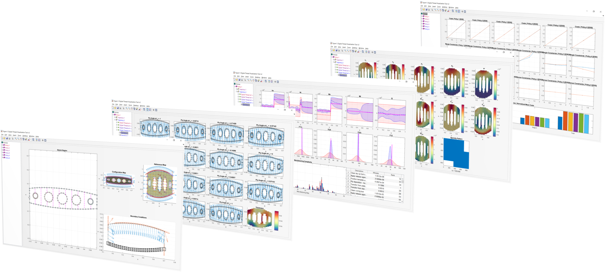

# DT-AVT
**Digital Thread Analysis and Visualization Tool (DT-AVT)**

*Screenshots of DT-AVT*

# About 
This repository contains the analysis and visualization tool used in the following articles and thesis:

- Singh V (2019) Towards a Feedback Design Process Using Digital Thread. PhD Thesis, MIT
- Singh V, Willcox K (2018) Engineering Design with Digital Thread. AIAA Journal 56 (11):4515–4528, DOI 10.2514/1.J057255

Digital Threads, Digital Twins, and the design process at various stages can be analyzed and visualized at the component level within this tool. Different policies can be compared (including designs) and their performances can be quantified. The tool is written in the context of the example design ribweb problem presented in the above works though it can be readily modified to suite other design scenarios. All code is written in MATLAB R2018b on a Windows 10 64-bit machine.

# Quick Start
A demo ribweb has been setup for running and viewing.
1. Launch `visualizer.m`. From there, right-click in the right pane and select load. From the loading screen, load `Demos/RibWebSeed.mat`. 
1. Next, initialize policies by right-clicking in the right pane and selecting `Policies > Initialize`. 
1. Once the policies are initialized, evaluate the policies by right-clicking in the right pane and selecting `Policies > Evaluate`. Once policies are evaluated, you can navigate Digital Threads and Twins using the search tree on the left. Additional viewing options at different tree levels can be accessed by right-clicking on figure axes that pop up.
1. To optimize policies, right-click in the right pane and select `Policies > Optimize`. Currently, optimization is done for one iteration across all stages and policies. This is controlled in the function `bellmanBackup.m\bellmanBackup` (for iterations) and `visualizer.m\optimizePolicies` (for which policies to be run). For good results, it is recommended to run for at least 100 iterations (~approx 10-15 hrs on a Windows 10 64-bit laptop). The results in the works above have been run for over 2000 iterations.

# Contact
If you need more detailed instructions, assistance for navigation (including all features of the tool not described in **Quick Start**), or setting up and running your own design problem, please email: 

victorsi at mit dot edu 

